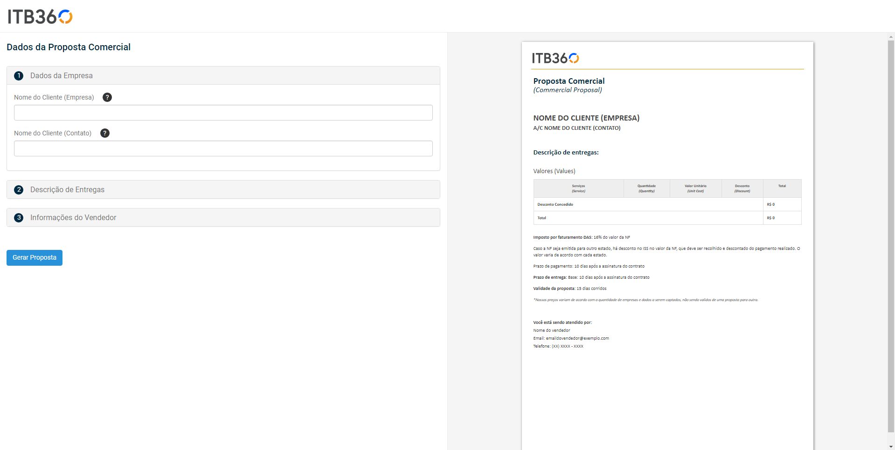
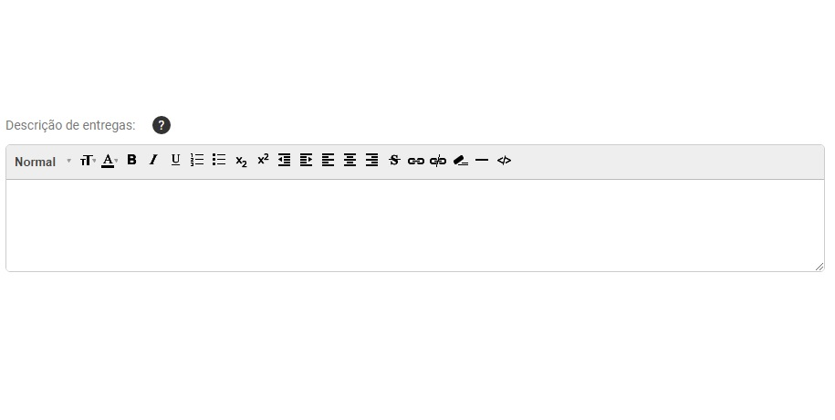
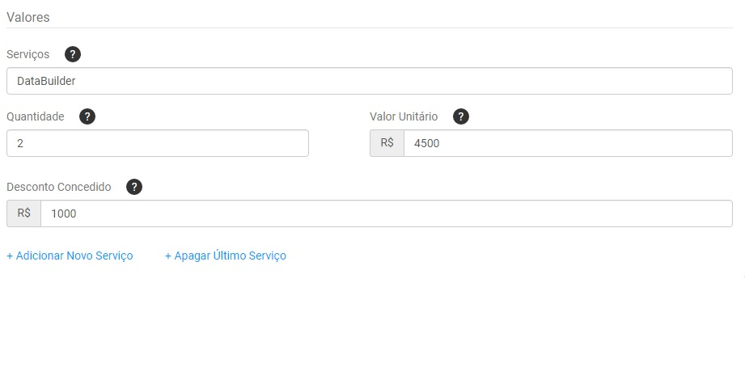
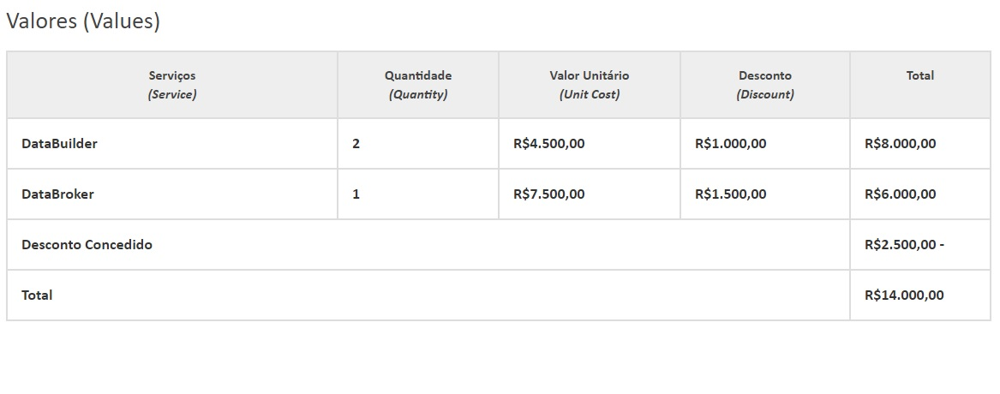

# Desafio Front-End ITB360

## Instruções para o desafio
- **Fork** esse repositório e faça esse desafio em uma branch com o seu nome. Exemplo: (`nome-sobrenome`);
- Assim que concluir o seu desafio,  abra um **pull request** com suas alterações.

### Desafio
- O desafio consiste no desenvolvimento de uma tela de preenchimento automático de proposta comercial, tendo como base o layout abaixo;

- Com esse desafio de front-end queremos avaliar seus conhecimentos com `HTML`, `CSS` e `JavaScript`. Não é necessário o desenvolvimento de qualquer código para backend ou banco de dados.

- Do lado esquerdo, devem ficar os `accordions` referentes aos **Dados de Empresa**, **Descrição das Entregas** e **Informações do Vendedor**. Ao clicar, o `accordion` deve se tornar ativo, exibindo na área logo abaixo os `<inputs>` onde cada informação será preenchida. 

- Do lado direito, deve ser exibida uma área com a pré-visualização do documento de proposta comercial. [Aqui](assets/images/commercial_proposal.html) você encontra a prévia do documento, onde estão marcados com asteriscos os campos que devem ser substituídos pelas informações digitadas nos campos à esquerda.

- Ao final, após preencher todo o documento, o usuário deve ter a opção de clicar no botão **GERAR PROPOSTA**. Ao fazer isso, a tela deve mostrar as informações de impressão apenas da proposta comercial, com o mesmo layout exibido na pré-visualização;

### Escopo

- No `accordion` de **Dados da Empresa**, devem ser exibidos dois `<inputs>`: um para inserir o nome da empresa que receberá a proposta comercial, e o outro onde será inserido o nome do responsável dentro da empresa.

- No `accordion` de **Descrição de Entregas** será necessário criar um elemento onde o usuário irá inserir o texto de descrição de produtos, serviços, diferenciais, observações, etc. que devem estar contidos na proposta comercial. Esse campo será praticamente todo texto, mas para que o usuário possa editá-lo como se estivesse usando um editor como o `Word`, você pode incorporar `libraries` de editor de texto WYSIWYG, ou usar as propriedades `contenteditable` do HTML 5 para isso. 

- [Clique](https://code.tutsplus.com/tutorials/create-a-wysiwyg-editor-with-the-contenteditable-attribute--cms-25657) para ver um exemplo de como criar um editor de texto
- [Clique](https://codeburst.io/how-to-build-your-own-wysiwyg-editor-6002fa3f5ea8) para ver outro exemplo de editor de texto

- Além disso, será necessário discriminar os produtos e serviços que farão parte da proposta comercial, incluindo-os numa tabela com informações como o nome do serviço ou produto, a quantidade, o valor unitário e um campo onde é possível adicionar um desconto.

- Assim que as informações de todos os `<inputs>` forem informados e o usuário clicar no botão **Adicionar Novo Serviço**, a linha deve ser adicionada na tabela dentro do documento de proposta comercial. O valor total de cada serviço, que corresponde ao valor unitário multiplicado pela quantidade de itens e subtraído o desconto, deve ser exibido no final de cada linha. O total somado de todos os descontos deve ser exibido na linha de **Desconto Concedido**, e o total do valor da proposta comercial deve ser exibido em **Total**. Todos os valores monetários devem estar formatados com **R$** na frente, as classes númericas (milhares, milhões, bilhões) devem ser formatados com `.` e as casas decimais com `,`, limitadas a dois dígitos. Ao clicar no botão **Apagar Último Serviço**, a última linha inserida deve ser eliminada, e os valores presentes em **Total** e **Desconto Concedido** devem ser recalculados de acordo com os serviços que ainda estão presentes na tabela.
Abaixo um exemplo da tabela de serviços no documento de proposta comercial:

- No `accordion` de **Informações do Vendedor** deve haver três `<inputs>`: um para inserir o nome do vendedor, que no caso é o próprio usuário; o segundo, para informar o email do vendedor; e o terceiro, para informar o telefone do vendedor. Na proposta comercial, o telefone do vendedor deve aparecer no formato `(XX) X-XXXX-XXXX`.

### Requisitos
- Código limpo e organizado;
- Responsividade;
- Validação de campos e exibição de mensagem com o erro;
- Minificação de código com automatizador de tarefas (ex.: Gulp, Grunt);

### Prazo
- Uma semana

